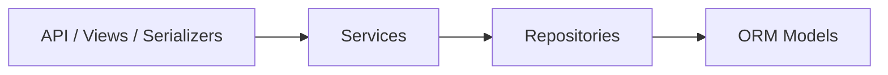

# Architecture

## Clean Architecture Layers

The app is structured so HTTP concerns stay in the API layer, business rules live in services, database access is isolated in repositories, and ORM entities stay in models.

## CAP Tradeoff

This project runs as a single-region app on SQLite for local development and can be switched to Postgres with a settings change. At this scale, the practical bias is toward consistency for task state, annotations, and authentication. If the product ever became distributed, the task board and annotation persistence would still favor consistency over availability because stale or conflicting edits would be more harmful than a brief write rejection. A future presence or cursor-sharing feature would likely choose higher availability instead, because short-lived collaboration state is acceptable to lose temporarily.

## Database Maintenance Note

`updated_at` is currently maintained by Django model fields (`auto_now=True`) rather than database-specific triggers so the project stays portable across SQLite and Postgres during development. Audit-log style side effects are intended to move into signals or service hooks later without changing the API surface.
